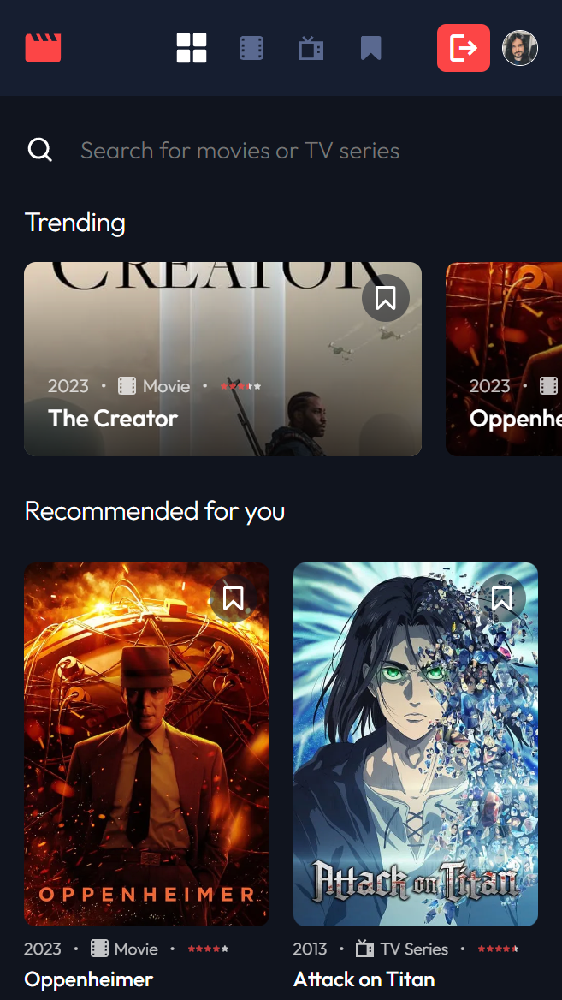
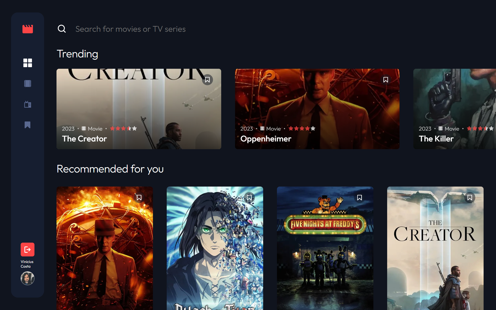

# Frontend Mentor - Entertainment web app solution

This is a solution to the [Entertainment web app challenge on Frontend Mentor](https://www.frontendmentor.io/challenges/entertainment-web-app-J-UhgAW1X). Frontend Mentor challenges help you improve your coding skills by building realistic project.

## Table of contents

- [Overview](#overview)
  - [The challenge](#the-challenge)
  - [Screenshot](#screenshot)
  - [Links](#links)
- [My process](#my-process)
  - [Built with](#built-with)
  - [What I learned](#what-i-learned)
  - [Continued development](#continued-development)
  - [Useful resources](#useful-resources)
- [Author](#author)

## Overview

### The challenge

Users should be able to:

- View the optimal layout for the app depending on their device's screen size
- See hover states for all interactive elements on the page
- Navigate between Home, Movies, TV Series, and Bookmarked Shows pages
- Add/Remove bookmarks from all movies and TV series
- Search for relevant shows on all pages
- **Bonus**: Build this project as a full-stack application
- **Bonus**: If you're building a full-stack app, we provide authentication screen (sign-up/login) designs if you'd like to create an auth flow

### Screenshot

### Links

- Solution URL: [https://www.frontendmentor.io/solutions/entertainment-web-app-with-nextjs-wlAU7Jwn5g](https://www.frontendmentor.io/solutions/entertainment-web-app-with-nextjs-wlAU7Jwn5g)
- Live Site URL: [https://entertainment-web-app-nextjs-viniciuscosta89.vercel.app/](https://entertainment-web-app-nextjs-viniciuscosta89.vercel.app/)

## My process

### Built with

- Semantic HTML5 markup
- CSS custom properties
- Flexbox
- CSS Grid
- Mobile-first workflow
- [React](https://reactjs.org/) - JS library
- [Next.js](https://nextjs.org/) - React framework
- [Typescript](https://www.typescriptlang.org) - JavaScript with syntax for types
- [Styled Components](https://styled-components.com/) - For styles (CSS-in-JS)
- [Sass](https://sass-lang.com) - For specific styles
- [Axios](https://axios-http.com/) - Promise based HTTP client for the browser and node.js
- [TanStack Query](https://tanstack.com/query/latest/docs/react/overview) - Powerful asynchronous state management for TS/JS
- [NextAuth.js](https://next-auth.js.org/) - Authentication for Next.js
- [supabase](https://supabase.com/) - Supabase is an open source Firebase alternative
- [Framer Motion](https://www.framer.com/motion/) - Framer Motion is a simple yet powerful motion library for React
- [Splide](https://splidejs.com/) - Splide is a lightweight, flexible and accessible slider/carousel
- [React Rating](https://github.com/smastrom/react-rating) - Zero dependency, highly customizable rating component for React
- [Nodemailer](https://nodemailer.com/) - Nodemailer is a module for Node.js applications to allow easy as cake email sending
- [SendGrid](https://sendgrid.com/en-us) - SMTP Service: Send email reliably—no email servers required.

### What I learned

Mostly I wanted to improve my knowledge of Next.js and its features.

For me, it was a challenge to work with a database and authentication. But Next-auth made authentication easy. Just to set up a way to send email was hard. I chose Supabase to store user accounts because Firebase didn't help me. I found some difficulties so Supabase was easier to work with.

Framer Motion always helps me make things smooth.

### Continued development

Improve performance and make unit tests.

### Useful resources

- [YouTube](https://www.youtube.com) - A bunch of NextAuth, Nodemailer and SendGrid tutorials helped me a lot!

## Author

- Website - [Vinicius Costa](https://viniciuscosta.dev/)
- GitHub - [https://github.com/viniciuscosta89](https://github.com/viniciuscosta89)
- Frontend Mentor - [@viniciuscosta89](https://www.frontendmentor.io/profile/viniciuscosta89)
